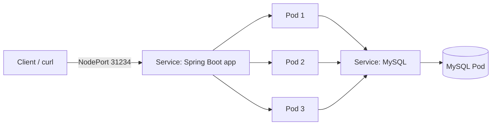

# springboot-mysql-kubernetes

A Spring Boot CRUD application with a MySQL database, containerized with Docker and deployed on a **Kubernetes cluster (Minikube)** running on an AWS EC2 Ubuntu instance.

> Built as part of my DevOps training.

## Architecture



## Tech stack

- Java, Spring Boot, Maven
- MySQL
- Docker
- Kubernetes (Minikube)
- AWS EC2 (Ubuntu)

## Project structure

```
springboot-mysql-kubernetes/
├── src/                    # Spring Boot application source
├── pom.xml
├── Dockerfile
├── k8s/
│   ├── db-deployment.yaml  # MySQL deployment and service
│   └── app-deployment.yaml # Spring Boot deployment (3 replicas) and NodePort service
├── docs/                   # screenshots
└── README.md
```

## Deployment steps

**1. Set up the cluster**

Minikube was installed on an AWS EC2 Ubuntu instance and a Kubernetes cluster was started.

**2. Deploy the MySQL database**

```bash
kubectl apply -f k8s/db-deployment.yaml
kubectl get pods
```

Wait until the MySQL pod shows `Running` and ready.

**3. Build the application**

```bash
mvn clean package -DskipTests
```

> Tests were skipped because of a configuration issue in the test setup. Fixing the test configuration is on my improvement list.

**4. Build the Docker image**

```bash
docker build -t springboot-crud-k8s:1.0 .
docker images
```

**5. Load the image into Minikube**

Minikube runs its own container runtime, so the locally built image has to be loaded into it:

```bash
minikube image load springboot-crud-k8s:1.0
```

**6. Deploy the application (3 replicas)**

```bash
kubectl apply -f k8s/app-deployment.yaml
kubectl get pods
kubectl get svc
```

**7. Test the API**

```bash
curl http://<minikube-ip>:31234/orders
```

Expected output on a fresh database:

```
[]
```

An empty list confirms the app is running and can reach MySQL.

## Screenshots

Add to `docs/` and link here (blur account IDs and public IPs):

- MySQL pod running
- Maven build success
- Docker image created
- Application pods running (3 replicas)
- Service with NodePort
- API response

## Challenges and learnings

- Locally built images are not visible to Minikube until loaded with `minikube image load`.
- The application pod depends on the MySQL service being reachable, so the database is deployed first.
- Add your own notes here: errors you hit and how you fixed them.

## Possible improvements

- Fix the test configuration so the build runs without `-DskipTests`
- Store database credentials in a Kubernetes Secret and settings in a ConfigMap
- Add a PersistentVolumeClaim for MySQL data
- Add readiness and liveness probes
- Push the image to a registry instead of loading it manually
